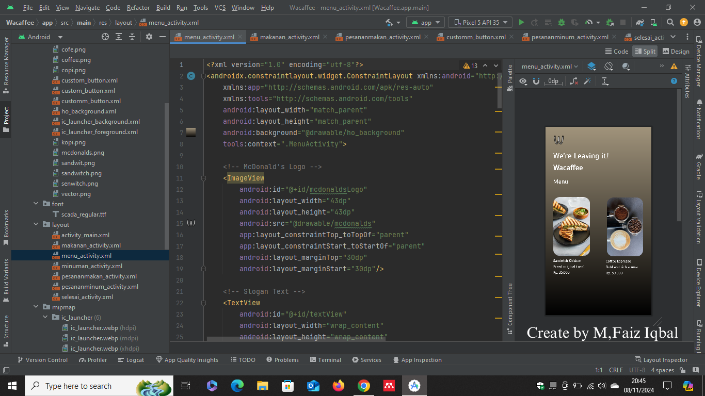

# Project UTS & UAS{ Semester 3 } 

## Profil
|  |  |
| -------- | --- |
| **Nama** | Muhammad Faiz Iqbal |
| **Kelas** | TI.23.A.5 |
| **Mata Kuliah** | Pemrograman Mobile 1 |

# Wacaffee App

## Definisi Wacaffee App
**Wacaffee App** adalah aplikasi pemesanan makanan dan minuman yang memungkinkan pengguna untuk memesan dan menyesuaikan produk dengan cara yang cepat, intuitif, dan interaktif. Terinspirasi oleh antarmuka mesin pembelian di McDonald's, Wacaffee App dirancang untuk memberikan pengalaman pemesanan yang modern dan mudah digunakan, memprioritaskan kenyamanan serta aksesibilitas pengguna.

## Status project : Phase 1
## Output

***Keterangan :***

- Berikut adalah tampilan awal apabila ``telah berhasil di RUN`` di awali dengan judul aplikasi **Wacaffee**.

## Output

***Keterangan :***

- Selanjutnya, setelah mengklik tombol button masuk, ``maka akan menampilan dengan logo Wacaffee dan beberapa menu``

## Output 

***Keterangan :***

- Selanjutnya, bisa langsung ``klik tombol menu Sandwitch``. Maka, tampilannya akan berubah untuk masuk ke detail produknya.

## Output

***Keterangan :***

- Selanjutnya, juga sama apabila ``klik tombol menu coffee espresso``. Maka, tampilannya akan berubah untuk masuk ke detail produknya.

## Output

***Keterangan :***

- Selanjutnya, setelah melihat beberapa deskripsi dan harga untuk masuk tahap pembelian yaitu ``dengan mengklik button Order New`` maka akan masuk ke...

## Output

***Keterangan :***

- begitu juga dengan melihat beberapa deskripsi dan harga dari detail produk **coffe espresso** maka untuk masuk tahap pembelian yaitu ``dengan mengklik button Order New`` maka akan masuk ke...

## Output

***Keterangan :***

- Selanjutnya, masuk tahap **Konfirmasi pembelian sukses** jika kita ``klik tombol button Order New,`` maka akan muncul tampilan teks *"Pesanan Anda sedang diproses, Konfirmasi Sukses !"*.

## Status project : Phase 2
Pada tahap ini, fokus utama kami adalah meningkatkan kualitas desain aplikasi untuk memberikan tampilan yang lebih modern, menarik, dan responsif. Perubahan desain mencakup:
## Apa yang Baru di Phase 2?
* Splash Screen ketika aplikasi dibuka menampilkan logo selama 3 detik
* Palet warna baru yang dirancang untuk menarik perhatian pengguna.
* Penambahan Launcher Icon baru untuk identitas aplikasi.
* Perubahan Terhadap font Wacaffee
* perubahan image di SplashScreen 
* penambahab Vector untuk melihat pemesanan makanan.

### Launcher Icon

## Fitur Utama
### Splash Screen

### Beranda 

### Hasil Pemesanan

## SELESAI  
